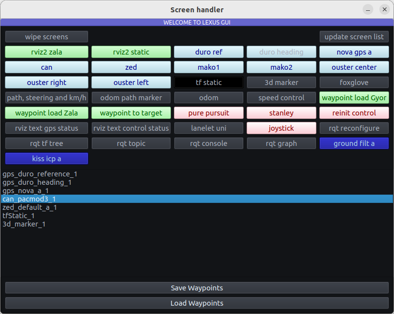

# `gui_lexus` ROS2 package
ROS2 GUI for Lexus

[](https://docs.ros.org/en/humble/)

## Build

It is assumed that the workspace is `~/ros2_ws/`. Tested on Ubuntu 22.04 ROS2 Humble.

### `Terminal 1` 🟢 pip
`Pyqtgraph` (`PyQt5`) is needed, tested on Python `3.10.6`.
``` python
pip install pyqtgraph # or pip3
```

### `Terminal 1` 🟢 clone

```
cd ~/ros2_ws/src
git clone https://github.com/jkk-research/gui_lexus
```

### `Terminal 1` 🟢 build
```
cd ~/ros2_ws
colcon build --packages-select gui_lexus
```

### `Terminal 2` 🔵 run
```
source ~/ros2_ws/install/local_setup.bash
ros2 run gui_lexus control_vehicle
ros2 launch gui_lexus only_gui.launch.py
ros2 launch gui_lexus foxglove_bridge_launch.xml
```

## CAN - PACMod3

- [Install Pacmod3](https://github.com/astuff/pacmod3#installation)
- [Install Kvaser](https://github.com/astuff/kvaser_interface#installation)

``` c
ros2 interface show pacmod3_msgs/msg/SystemCmdFloat
```


## Useful
``` bash
dev@u22glx:~$ colcon_cd gui_lexus
dev@u22glx:~/ros2_ws/src/gui_lexus(main)$ 
```

``` yaml
ros2 topic pub /pacmod/parsed_tx/vehicle_speed_rpt pacmod3_msgs/msg/VehicleSpeedRpt "{header: {stamp: {sec: 0, nanosec: 0}, frame_id: 'map'}, vehicle_speed: 0.1, vehicle_speed_valid: true}"
```


